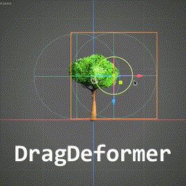

 

## godot-deformablemesh
**This addon allows to deform 3D meshes using a stack of customizable deformers at run-time**

 

   
  
   

## Main Features

Use the default deformers:
- `SphericalDeformer`   
- `StandardDeformer`  (Bend, Twist, and Taper)  
- `DragDeformer`  (In **Rest Pose Mode**, position the deformer, toggle it off, and deform the mesh by moving the node.)

 

Or **easily create your own** by extending the base class and overriding just a couple of methods in `dm_deformer.gd`.

## Getting Started

1. Download the [repository](https://github.com/cloudofoz/godot-deformablemesh/archive/refs/heads/main.zip) or download the *previous version* of the addon from the AssetLib in Godot ([link](https://godotengine.org/asset-library/asset/1794)).

2. Import the **addons** folder into your project.

3. Activate `DeformableMesh` under *Project > Project Settings > Plugins.*

  

4. Add a *deformer* node to the scene.

  

5. Add a `DeformableMeshInstance3D` node to the scene.

  

6. Set the *mesh resource* you want to deform in the **Original Mesh** property.

  

7. Link the *deformer node* you created before to the list of **Deformers** that will affect this mesh in the property panel.

  

7. Tweak the *deformer* properties to achieve the desired result.

  

## Example Project

1. [**You can download here**](media/dm_example_scene.zip) an example project that shows the basic functionalities of `DeformableMesh`.
2. Unzip the file
3. Import the project with Godot Engine 4+
4. Open the scene `dm_example_scene_v030.tscn` (if it's not already opened)

You can now try tweaking the deformer parameters. 
Some effects are also controlled by the positions and the rotations of the deformer nodes.

`DeformableMesh` can apply multiple deformers like in a stack, so the order is important to achieve the correct effect.
You need also to specify the correct deformation axis (for some effects like bending, but it's not important with spherical deformers).

## Known Limitations

- This addon is designed with simplicity and versatility as primary goals, making it well-suited for simple, standard use cases. However, it is not optimized for specialized use cases, such as higher-density meshes (and, in some cases, multiple surfaces, which may also impact performance) in performance-critical applications. Users are encouraged to thoroughly test the addon to ensure it meets their specific requirements.

- While other deformers support deforming multiple meshes at once, a `DragDeformer` can only be tied to a single mesh at a time.

## Changelog

**v0.40**

- **Add**: `DragDeformer` node.
- **Add**: `_on_end_update()` overridable method for the deformer base class.
- **Fix**: Removing a deformer now correctly unregisters the linked event listeners.
- **Fix**: `_on_begin_update()` is now called only once, even with multiple surfaces.

[**v0.30**](https://github.com/cloudofoz/godot-deformablemesh/releases/tag/v0.30)

- **Add**: `StandardDeformer` (Bend, Twist, and Taper).
- **Remove**: `BendDeformer` (now included as part of `StandardDeformer`).
- **Improve**: Deformer selection list.

[**v0.20**](https://github.com/cloudofoz/godot-deformablemesh/releases/tag/v0.20)

- **Add**: Bend deformers.
- **Add**: Base class to easily create custom deformers.
- **Refactor**: Codebase and minor improvements.

[**v0.10**](https://github.com/cloudofoz/godot-deformablemesh/tree/v0.1)

- **First release**

## License

[MIT License](/LICENSE.md)
