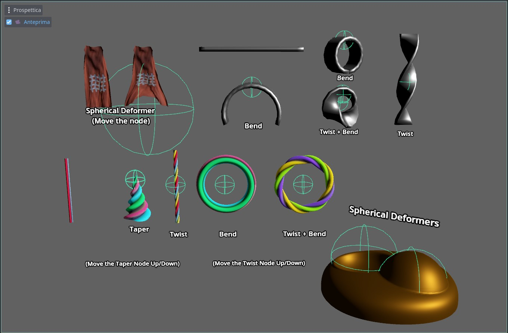
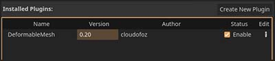
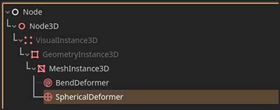
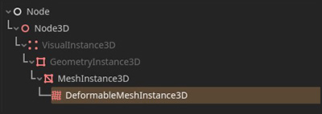
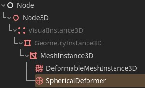
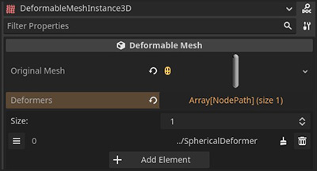
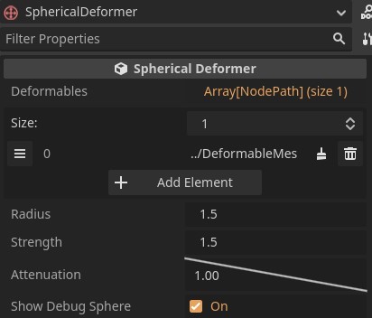

 

## godot-deformablemesh
**This addon allows to deform 3D meshes using a stack of customizable deformers at run-time**

 

  
  

## Main features

Use the default deformers:
- `SphericalDeformer` 
- `StandardDeformer`  ( Bend, Twist and Taper )
  
or **easily create your owns** by extending the base class and overriding just a couple of methods (*a tutorial will be available*).

## Getting Started

1. Download the [repository](https://github.com/cloudofoz/godot-deformablemesh/archive/refs/heads/main.zip) or download the addon from the AssetLib in Godot ([link](https://godotengine.org/asset-library/asset/1794)).

2. Import the **addons** folder into your project.

3. Activate `DeformableMesh` under *Project > Project Settings > Plugins.*

  

4. Add a *deformer* node to the scene.

  

5. Add a `DeformableMeshInstance3D` node to the scene.

  

6. Set the *mesh resource* you want to deform in the **Original Mesh** property.

  

7. Link the *deformer node* you created before to the list of **Deformers** that will affect this mesh in the property panel.

  

7. Tweak the *deformer* properties to achieve the desired result.

  

## Example Project

1. [**You can download here**](media/dm_example_scene.zip) an example project that shows the basic functionalities of `DeformableMesh`.
2. Unzip the file
3. Import the project with Godot Engine 4+
4. Open the scene `dm_example_scene_v030.tscn` (if it's not already opened)

You can now try tweaking the deformer parameters. 
Some effects are also controlled by the positions and the rotations of the deformer nodes.

`DeformableMesh` can apply multiple deformers like in a stack, so the order is important to achieve the correct effect.
You need also to specify the correct deformation axis (for some effects like bending, but it's not important with spherical deformers).

## Changelog

v0.30
- add: standard deformer ( bend, twist and taper )
- removed: bend deformer ( a better version is included inside the standard deformer )

[v0.20](https://github.com/cloudofoz/godot-deformablemesh/releases/tag/v0.20)

- add: bend deformers
- add: base class to easily create custom deformers
- code refactoring and minor improvements

[v0.10](https://github.com/cloudofoz/godot-deformablemesh/tree/v0.1)

- first release

## License

[MIT License](/LICENSE.md)
